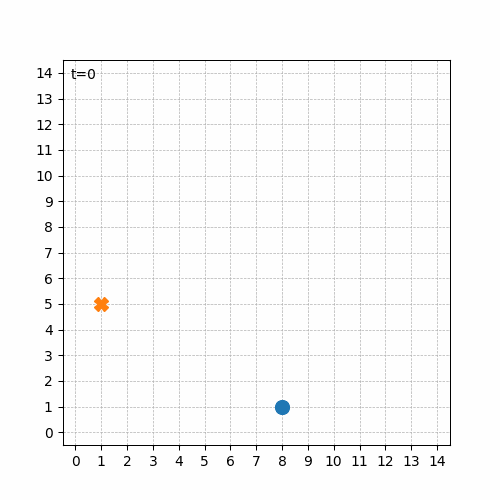
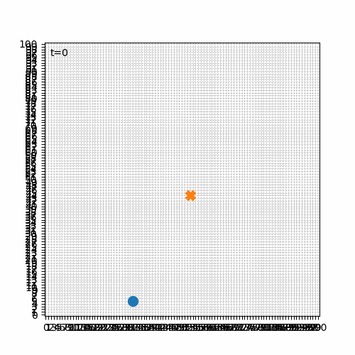

# 🚀 Decentralized Learning for Autonomous Kamikaze Drone Swarms with Integrated IFF and Target Engagement in Adversarial Environments

> ⚠️ **Ethics & Safety First.**  
> This repository is **strictly for simulation-based research** on decentralized multi-agent reinforcement learning.  
> No real-world deployment, weaponization, or harmful use is permitted or supported. Concepts like “kamikaze” and “target engagement” are treated as **non-destructive intercept/tagging** events **in simulation only** (e.g., virtual tag or contact).

## 📌 Overview
This project explores **decentralized multi-agent reinforcement learning (MARL)** for swarms of autonomous drones operating in **adversarial** simulated environments.  

My long-term vision is to learn **emergent coordination** (formation, target allocation, deconfliction) under **limited local observations** and **noisy/limited communications**, with an **IFF-like** (Identification-Friend-or-Foe) *simulated* module to avoid friendly interference and to prioritize valid targets.

At this very early stage (Aug, 2025), the repo contains a **single-agent baseline** on a 2D grid to validate training loops, reward shaping, and evaluation tooling. MARL, IFF simulation, and adversarial behaviors will be introduced progressively.

---

## ✨ Goals (High-Level)
- **Decentralization:** independent agents with local observations; optional, bandwidth-limited comms.
- **Emergent coordination:** task/target assignment, formation, and collision avoidance **without a central controller**.
- **Adversarial simulation:** moving/strategic targets, distractors, and counter-measures modeled in sim.
- **Robustness & generalization:** curriculum learning, noise/latency, domain randomization.
- **Safety constraints:** IFF-like *simulated* classification to avoid friendly “engagement” (non-destructive tagging).

---

## 🧪 Current Baseline (v0)
A minimal **DQN** (PyTorch) agent learns to intercept a **static target** on a discrete 2D grid.

**Key pieces**
- Reward shaping: positive when distance decreases (normalized), small penalties for zig-zag/revisit, arrival bonus.
- Double DQN, target network, replay buffer, epsilon-greedy with decay.
- Optional large grid, 8-direction actions + “stay”.

**Train & Play**
```bash
# 1) Create venv and install deps
python -m venv venv
# Windows
venv\Scripts\activate
# macOS/Linux
# source venv/bin/activate
pip install torch numpy matplotlib

# 2) Train (saves checkpoints/policy.pt + checkpoints/config.npz)
python train.py

# 3) Replay with animation (MP4 requires ffmpeg; otherwise use GIF)
python play.py --ckpt_dir checkpoints --out episode.mp4 --no_snap
# or
python play.py --ckpt_dir checkpoints --out step_1.gif --fps 6
```

---

## 🗺️ Roadmap (Milestones)
- ✅ **P0 — Tiny Grid**: single agent, small 2D grid, 4 directions + stay, static target; QNet with reward shaping.
Random execution of the trained model:

- ✅ **P1 — Big Grid DQN**: bigger grid (101×101), 8 directions + stay, normalized reward; stable DQN with reduced zig-zag.
Initial attempts:

Random execution of the trained model, after optimizations:

- 🛠️ **P2 — 2D continuous kinematics (x,y,vx,vy) + continuous actions (ax, ay)**: PPO/SAC; noise/latency/slip.
- **P3 — Moving Target**: stochastic/strategic motion; robustness in pursuit.
- **P4 — Static Obstacles**: random static obstacles; collision avoidance.
- **P5 — Moving Obstacles + Noisy**: dynamic obstacles; partial observability (egocentric crop); limited/noisy comms.
- **P6 — Multi-agent (decentralized)**: parameter sharing or indipendent policies, collision avoidance, task/target allocation.
- **P7 — Simplified 3D**: 3D kinematics (x,y,z,vx,vy,vz); altitude control.
- **P8 — Single Quadrotor light-physics**: simple quadrotor model (thrust, drag, gravity).
- **P9 — Multi Quadrotors**: decentralized multi-agent quadrotors.
- **P10 — IFF-like module**: simulated friend-or-foe classification to avoid friendly interference.
- **P11 — Adversarial Entities**: moving/strategic targets, distractors, counter-measures.
- **P12 — Curriculum & Domain Randomization**: progressively harder scenarios, environment randomization.

---

## 🤝 Contributing

PRs are welcome!